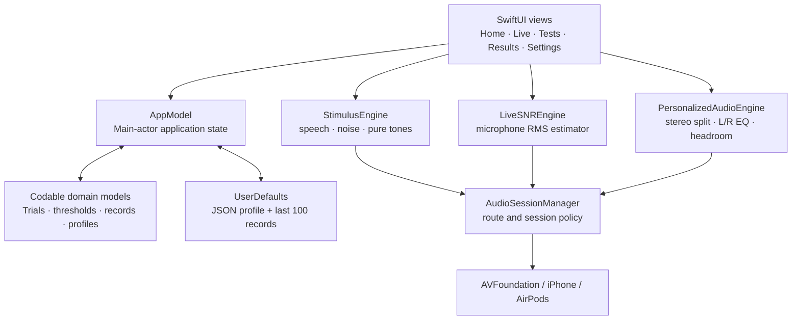

# SNR Lab

SNR Lab is an experimental iPhone application for exploring speech-in-noise
performance, bilateral relative pure-tone thresholds, listening conditions, and
frequency-specific stereo compensation with AirPods.

> [!IMPORTANT]
> SNR Lab is not a clinical audiometer, hearing aid, medical device, or diagnostic
> service. Pure-tone results are **relative hearing thresholds—not dB HL**.
> Results depend on the iPhone, AirPods model and fit, system volume, Bluetooth
> route, ambient noise, and uncalibrated device processing.

## What the app does

| Module | Current implementation | Output |
| --- | --- | --- |
| Live SNR | Microphone RMS tracking with rolling low/high percentiles | Relative speech, noise, and SNR estimates in dBFS/dB |
| Speech in noise | English or Spanish synthesized sentences mixed with six synthetic noises | Trial scores, sigmoid, SNR50, SNR80, SNR90, optional bootstrap intervals |
| Bilateral pure tone | Separate left/right AirPod channels, pulsed tones, 10-down/5-up staircase, catch trials, 1 kHz retest | Eight-frequency relative audiogram and quality metrics |
| Volume sensitivity | Six digital speech levels from −42 to −12 dBFS | Word recognition versus digital level |
| Noise profiles | Short adaptive speech runs by synthetic noise family | Per-noise SNR90 estimate |
| Personalized Audio | Independent eight-band left/right EQ derived from a saved bilateral result | Original/Compensated comparison for ten offline tracks |

The interface supports English and Spanish instructions. Speech tests provide
four voice profiles: Woman, Man, and higher-pitch Girl/Boy simulations selected
from compatible voices installed on the device.

## Architecture at a glance



The app uses only Apple frameworks: SwiftUI, Charts, AVFoundation, Foundation,
and Combine. It has no third-party package dependency and no application server.

Read the detailed design in [`docs/ARCHITECTURE.md`](docs/ARCHITECTURE.md).

## Scientific scope

The bilateral workflow borrows practical elements from conventional manual
air-conduction audiometry: familiarization, separate ears, a 1 kHz starting
frequency, the 1→2→3→4→6→8→1→0.5→0.25 kHz sequence, a 10-down/5-up search,
and a two-of-three ascending-response criterion. These elements are described in
the [ASHA Guidelines for Manual Pure-Tone Threshold Audiometry](https://www.asha.org/policy/GL2005-00014/).

Similarity of procedure does **not** make the result clinical. Conventional
audiometry requires calibrated equipment, standardized reference levels, a
controlled acoustic environment, appropriate transducers, masking when needed,
and trained interpretation. SNR Lab currently has none of the calibration needed
to convert its digital stimulus to SPL or dB HL.

The audiogram-like chart uses logarithmic frequency spacing and the conventional
right-ear red `O` / left-ear blue `X` visual distinction described by
[ASHA's audiometric-symbol guidance](https://www.asha.org/policy/gl1990-00006/),
but the ordinate is explicitly an uncalibrated relative scale.

See:

- [`docs/SCIENCE_AND_PHYSICS.md`](docs/SCIENCE_AND_PHYSICS.md) for units,
  waveforms, SNR, psychometrics, EQ, and calibration.
- [`docs/ALGORITHMS.md`](docs/ALGORITHMS.md) for exact state machines,
  constants, equations, and quality-score logic.
- [`docs/VALIDATION.md`](docs/VALIDATION.md) for what has and has not been
  validated.

## Pure-tone screening summary

- Frequencies: 250, 500, 1000, 2000, 3000, 4000, 6000, and 8000 Hz.
- One ear at a time; the opposite digital channel is silent.
- Three 240 ms pulses with 140 ms gaps and 25 ms attack/release ramps.
- Random pre-stimulus delay of 0.85–2.15 seconds.
- Occasional silent catch trials and premature-tap tracking.
- Heard response: 10 relative units quieter; missed response: 5 units louder.
- Threshold: lowest ascending level heard at least twice and on at least 50% of
  ascending presentations at that level.
- Maximum 16 real presentations per frequency; fallback results are flagged.
- Repeated 1 kHz result per ear; differences above five relative units reduce
  the app's heuristic reliability rating.

All relative-level changes occur in a digital domain. Five relative units map to
3.75 dB of generated dBFS in the current implementation; this is not a 5 dB HL
clinical step.

## Personalized Audio

A saved bilateral pure-tone result is converted into separate left/right EQ
curves:

1. Find a within-ear lower-quartile reference threshold.
2. Keep only positive frequency-specific deviations from that reference.
3. Apply half gain.
4. Smooth each band with 60% center and up to 20% from each neighbor.
5. Limit boost to the user-selected 0–20 dB maximum.
6. Reserve global digital headroom equal to the largest boost plus 1 dB.

The first and last bands are low/high shelves; intermediate bands are parametric
filters with 0.8-octave bandwidth. Both Original and Compensated modes share the
same headroom attenuation to make switching less misleading.

This is an experimental relative EQ—not a hearing-aid fitting rule, loudness
normalization standard, prescription, or guarantee of improved fidelity.

## Data and privacy

- Profiles and up to 100 named test records are JSON-encoded into `UserDefaults`.
- Microphone buffers are analyzed in memory and are not intentionally recorded.
- The app contains no analytics SDK, account system, advertising SDK, or network
  upload code.
- Ten demonstration tracks are bundled for offline playback.
- A Reset control clears the saved profile and test history.

See [`docs/DATA_AND_PRIVACY.md`](docs/DATA_AND_PRIVACY.md) and
[`PRIVACY.md`](PRIVACY.md) before distributing the app.

## Build and run

Requirements:

- macOS with a recent Xcode version capable of building for iOS 17.
- iPhone running iOS 17 or later.
- Apple Account for personal-device testing; Apple Developer Program membership
  for App Store distribution.
- Stereo AirPods for the bilateral pure-tone workflow.

Steps:

1. Open `SNRLab.xcodeproj`.
2. Select the SNRLab target and choose your signing team.
3. Replace `com.example.SNRLab` with a unique permanent bundle identifier.
4. Connect an iPhone and select it as the run destination.
5. Build and run.
6. Grant microphone access only if using Live SNR or the optional room-noise check.

Development and release notes are in
[`docs/DEVELOPMENT.md`](docs/DEVELOPMENT.md).

## Repository map

```text
SNRLab/
├── SNRLab.xcodeproj/
├── SNRLab/
│   ├── App/                 # app entry and persistent state
│   ├── Audio/               # capture, synthesis, test stimuli, stereo EQ
│   ├── Models/              # Codable records and numerical algorithms
│   ├── Resources/           # plist, assets, and offline music
│   └── Views/               # SwiftUI modules and charts
├── docs/                    # architecture, science, algorithms, validation
├── COPYRIGHT.md
├── PRIVACY.md
└── README.md
```

## Documentation index

- [Architecture](docs/ARCHITECTURE.md)
- [Science and physics](docs/SCIENCE_AND_PHYSICS.md)
- [Algorithms and constants](docs/ALGORITHMS.md)
- [Data model and privacy](docs/DATA_AND_PRIVACY.md)
- [Validation and limitations](docs/VALIDATION.md)
- [Development and release](docs/DEVELOPMENT.md)
- [References](docs/REFERENCES.md)
- [Copyright](COPYRIGHT.md)
- [Bundled music license notes](SNRLab/Resources/DemoMusic/LICENSE.md)

## Project status

This repository is an iPhone MVP and engineering research prototype. It has been
type-checked and run on a physical iPhone, but it has not undergone acoustic
calibration, clinical validation, accessibility certification, security audit,
formal usability testing, or regulatory review.

## Copyright

Copyright © 2026 Guillermo Jenaro. All rights reserved. See
[`COPYRIGHT.md`](COPYRIGHT.md). Bundled CC0/public-domain music is excluded from
this claim and documented separately.
