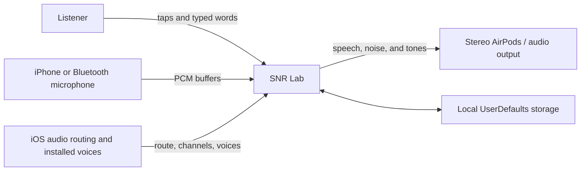
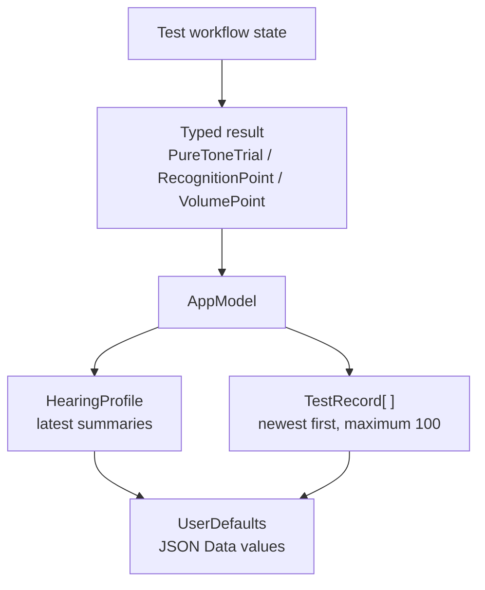
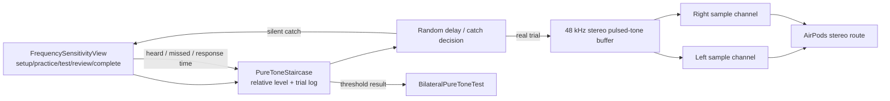
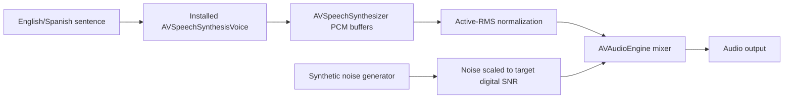
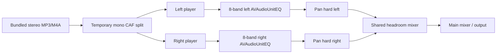

# Architecture

## Design goals

SNR Lab is structured as a local-first SwiftUI application with four engineering
priorities:

1. Keep pure-tone, speech-in-noise, volume, and environmental measurements as
   separate domains.
2. Preserve raw behavioral observations, not only summary values.
3. Route left and right signals explicitly so a bilateral result never collapses
   into one threshold curve.
4. Leave calibration, masking, external transducers, import/export, and clinical
   reporting as explicit extension points rather than pretending they exist.

The current implementation is intentionally small: one application target, no
third-party packages, no server, and no dependency-injection framework.

## System context



The application does not control AirPods firmware, noise-control mode, system
volume, acoustic coupling, or Bluetooth processing. It asks the listener to keep
those conditions stable and records only the route information exposed by iOS.

## Source layout and responsibilities

| Path | Responsibility |
| --- | --- |
| `SNRLab/App/SNRLabApp.swift` | App entry point, root `AppModel`, forced dark appearance |
| `SNRLab/App/AppModel.swift` | Observable state, test naming, record creation, JSON persistence |
| `SNRLab/Models/Models.swift` | Codable domain records, staircase, word scorer, sigmoid fit, bootstrap |
| `SNRLab/Audio/AudioEngines.swift` | Audio sessions, route inspection, microphone estimator, synthesis, test stimuli |
| `SNRLab/Audio/PersonalizedAudioEngine.swift` | Music catalog, stereo channel split, independent EQ, playback and headroom |
| `SNRLab/Views/MainViews.swift` | Root tabs, live display, results, audiograms, history, settings |
| `SNRLab/Views/TestViews.swift` | Test hub and behavioral test workflows |
| `SNRLab/Views/PersonalizedAudioView.swift` | Measurement selector, music player, filter graph and comparison controls |
| `SNRLab/Resources` | App metadata, icon, colors, music and license notes |

## UI composition

`RootView` contains five navigation stacks in a tab view:

- **Home**: module entry points and latest SNR summary.
- **Live**: microphone-based rolling relative SNR.
- **Test**: speech in noise, bilateral pure tone, volume sensitivity, and noise
  profile modules.
- **Results**: pure-tone profile, speech psychometric data, test-quality metrics,
  history, and entry to Personalized Audio.
- **Settings**: language, voice, audio guidance, limitations, safety, copyright,
  and data reset.

Views own short-lived workflow state with `@State` and audio engines with
`@StateObject`. Shared results and preferences live in `AppModel`, injected with
`environmentObject`.

## State and persistence



Four versioned keys are currently used:

- `snrlab.profile.v1`
- `snrlab.history.v1`
- `snrlab.language.v1`
- `snrlab.voice.v1`

The profile and history are encoded with `JSONEncoder`. The saved history is
truncated to the 100 most recent records. There is no schema migration service;
compatibility relies on custom/default decoding in the models and stable key
names.

## Audio-session policy

`AudioSessionManager` centralizes two modes:

| Mode | Category | AVAudioSession mode | Use |
| --- | --- | --- | --- |
| Measurement | `playAndRecord` | `measurement` | Live SNR and room-noise estimate |
| Playback | `playback` | `default` | Speech, synthetic noise, tones, music |

Playback requests two output channels when the active route supports them.
`outputRouteStatus()` records the first output name, whether iOS classifies it as
Bluetooth, whether the route name contains “AirPods,” and the reported channel
count. A route is accepted for the bilateral test only when it is AirPods-named
and has at least two channels.

This is a practical setup guard, not hardware attestation. Public iOS APIs do not
prove that each physical earbud is inserted correctly, so the UI adds audible
left/right checks and listener confirmations.

Apple documents `AVAudioSession.outputNumberOfChannels` as the number of channels
on the current route. See [Apple's channel documentation](https://developer.apple.com/documentation/avfaudio/avaudiosession/outputnumberofchannels).

## Pure-tone signal path



For a real trial, only the target channel receives the sinusoid; the opposite
channel is filled with zeros. The generator has an optional opposite-channel
noise parameter reserved for future experiments, but the current screening flow
always passes `nil`. This is not clinical masking.

The view rechecks the route before every presentation and pauses if the AirPods
stereo route disappears. The workflow is a state machine with these phases:

```text
setup → bilateral practice → left test → left review
      → right test → right review → save/complete
```

## Speech and noise path



Voice selection is dynamic because voice availability differs by device. The
resolver prefers a requested language and gender, ranks by Apple voice quality,
excludes novelty and Personal Voice entries, and falls back to the nearest
available language. Girl and Boy are higher-pitch simulations, not recordings of
children and not an age classification provided by Apple.

Speech is emitted as PCM buffers with `AVSpeechSynthesizer.write`. Apple describes
this API as generating speech into a buffer callback for further processing:
[speech buffer documentation](https://developer.apple.com/documentation/avfaudio/avspeechsynthesizer/write%28_%3Atobuffercallback%3A%29).

## Live SNR path

`LiveSNREngine` installs a 2048-frame tap on the first microphone channel. Each
buffer becomes a full-scale-relative RMS level. A rolling window of at most 120
levels is sorted; the 20th percentile is the noise estimate and the 82nd
percentile is the signal estimate. Their difference is clamped to −10…40 dB and
published about every 160 ms.

No classifier identifies actual speech. The terms “signal” and “noise” are
therefore operational labels for upper and lower portions of recent level
activity, not isolated acoustic sources.

## Personalized Audio graph



The source file is read in 16,384-frame chunks and split into temporary float32
mono CAF files. Mono source files are duplicated to both sides. Two synchronized
player nodes preserve channel-specific processing. Original mode bypasses both
equalizers; Compensated mode enables them. The shared downstream mixer applies
the same conservative headroom in both modes.

`AVAudioEngine` is Apple's node-graph audio system, and `AVAudioUnitEQ` exposes
frequency, gain, bandwidth, filter type, and bypass controls. See
[AVAudioEngine](https://developer.apple.com/documentation/avfaudio/avaudioengine)
and [EQ filter parameters](https://developer.apple.com/documentation/avfaudio/avaudiouniteqfilterparameters/filtertype).

## Concurrency and lifecycle

- UI state and observable audio objects run on the main actor.
- Speech synthesis is exposed as `async` and returns buffers through a checked
  continuation.
- Pure-tone randomized waits and response windows use cancellable Swift tasks.
- Microphone callbacks perform buffer arithmetic, then publish on the main actor.
- Views stop their audio engine when leaving the screen.
- Each test presentation carries a UUID token so a stale task cannot complete a
  newer trial.

## Failure boundaries

Audio failures surface as user-visible messages instead of crashing the flow.
Typical failures include microphone denial, no input format, missing voice,
missing bundled audio, a non-stereo route, or a route change during testing.

Behavioral results that reach the per-frequency presentation cap are saved with
`metAscendingCriterion == false` and reduce the reliability score. They are not
silently treated as fully reliable thresholds.

## Planned extension seams

`BilateralPureToneTest` already contains optional fields for:

- a calibration profile identifier;
- a transducer model identifier;
- bone-conduction results;
- masking metadata;
- an imported-source identifier;
- a prior-test link for longitudinal comparison.

These fields are data-model hooks only. No calibration, bone conduction,
clinical masking, import, or longitudinal inference is implemented.

Likely future boundaries are:

1. Replace `UserDefaults` with a versioned database and explicit migration layer.
2. Isolate algorithms into a testable Swift package.
3. Add a calibrated transducer/output service keyed by verified device model.
4. Add export schemas without changing the internal trial log.
5. Add a validation layer that distinguishes engineering, research, and clinical
   operating modes.
