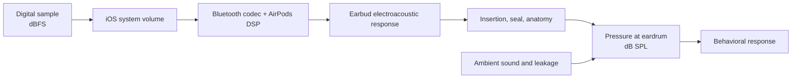

# Science and physics

This document explains the physical and mathematical ideas used by SNR Lab and,
just as importantly, the boundaries between a digital experiment and a clinical
acoustic measurement.

## 1. Three different level domains

The word “decibel” describes a logarithmic ratio; it is not a complete unit until
the reference quantity and measurement conditions are known.

| Quantity | Reference | What it means | Used by SNR Lab? |
| --- | --- | --- | --- |
| dBFS | Maximum representable digital amplitude | Level inside a digital audio path | Yes |
| dB SPL | 20 µPa acoustic pressure in air | Physical sound pressure at a location | No calibrated measurement |
| dB HL | Frequency-specific audiometric reference-equivalent threshold | Clinical hearing level | No |
| dBA | A-weighted acoustic sound level | Frequency-weighted SPL often used for exposure | No calibrated measurement |

For an amplitude ratio, the decibel relationship is

$$
L_\mathrm{dB}=20\log_{10}\left(\frac{A}{A_0}\right),
$$

and the inverse relationship is

$$
\frac{A}{A_0}=10^{L_\mathrm{dB}/20}.
$$

For a power ratio, the coefficient is 10 instead of 20.

SNR Lab uses normalized floating-point PCM, so digital full scale is the relevant
reference. A sample amplitude of 1 is nominal full scale and negative dBFS values
represent fractions of it. Nothing in that statement specifies the pressure
produced at the eardrum.

## 2. Why dBFS cannot be labeled dB HL

The acoustic path is a chain:

Every block can vary. A valid conversion to dB SPL requires a measured transfer
function for the relevant device, route, volume setting, fit, and coupler or ear
condition. A valid conversion from SPL to dB HL additionally requires the
frequency-specific audiometric reference appropriate to the transducer and
standard.

The [ASHA manual pure-tone guidelines](https://www.asha.org/policy/GL2005-00014/)
describe clinical threshold audiometry in terms of calibrated equipment,
controlled environments, standardized frequencies, appropriate transducers,
and masking when required. SNR Lab copies selected behavioral workflow elements
but does not provide that calibration chain.

Consequences:

- A threshold of 30 relative units is not 30 dB HL.
- A five-unit staircase step is not a clinical 5 dB HL step.
- Results from two AirPods models cannot be assumed comparable.
- Repeating with a different system volume invalidates direct comparison.
- Active Noise Cancellation, Adaptive Audio, Transparency, fit, and firmware can
  alter the effective acoustic stimulus.

## 3. Pure-tone synthesis

The app renders a sinusoid at a sampling rate of 48 kHz:

$$
x[n]=A\,e[n]\sin\left(2\pi f\frac{n}{F_s}\right),
$$

where:

- $F_s=48{,}000$ samples/s;
- $f$ is one of 250, 500, 1000, 2000, 3000, 4000, 6000, or 8000 Hz;
- $A$ is the digital amplitude;
- $e[n]$ is a pulse envelope.

The level conversion implemented by the bilateral workflow is

$$
L_\mathrm{dBFS}=\operatorname{clamp}(-70+0.75r,-70,-10),
$$

where $r$ is the staircase's 0–80 relative-unit level. The PCM amplitude is then

$$
A=\min\left(0.32,10^{L_\mathrm{dBFS}/20}\right).
$$

At the current limits, the explicit 0.32 amplitude cap is approximately the same
as the −10 dBFS ceiling. These are software bounds, not verified acoustic safety
limits.

### Pulse envelope

A normal presentation contains three pulses:

- 240 ms tone;
- 140 ms silent gap;
- 240 ms tone;
- 140 ms silent gap;
- 240 ms tone.

Each tone uses a linear attack and release of up to 25 ms:

$$
e(t)=\max\left(0,\min\left(1,\frac{t}{T_r},
\frac{T_p-t}{T_r}\right)\right),
$$

with pulse duration $T_p$ and ramp duration $T_r$. Ramping reduces abrupt sample
discontinuities and the broad spectral splatter that a hard rectangular edge
would create.

### Sampling and Nyquist

The highest test frequency is 8 kHz, below the 24 kHz Nyquist frequency of a
48 kHz sample rate. That prevents mathematical aliasing of the ideal generated
sinusoid, but it does not guarantee a flat AirPods frequency response, a pure
acoustic output, or the absence of device-generated distortion.

## 4. Ear separation

The generated buffer has two channels. During a left-ear trial:

$$
x_L[n]=x[n],\qquad x_R[n]=0,
$$

and the assignment is reversed for the right ear.

Digital channel separation is necessary but not sufficient to establish clinical
ear-specific thresholds. Acoustic leakage, bone conduction through the head, fit,
and interaural attenuation are not measured. The non-test ear is normally silent.
The reserved masking parameter is unused and must not be described as clinical
masking.

## 5. Audiogram geometry

Audiograms conventionally place increasing frequency from left to right on a
logarithmic axis and better/quieter thresholds toward the top. The app maps
frequency to an x-coordinate with

$$
x(f)=\log_2\left(\frac{f}{250}\right).
$$

Each octave therefore has equal horizontal width. The plotted vertical value is
the negative of the 0–80 relative threshold so increasing required level appears
lower on the screen.

The app uses a red `O` for the right ear and a blue `X` for the left ear, drawing
on [ASHA audiometric-symbol guidance](https://www.asha.org/policy/gl1990-00006/).
That visual convention does not change the uncalibrated ordinate into dB HL.

## 6. Adaptive threshold estimation

Behavioral detection is probabilistic. A listener may miss a tone they could
sometimes hear or respond when no tone occurred. Repeating every possible level
many times would be slow, so an adaptive staircase concentrates observations near
the transition between usually missed and usually heard.

SNR Lab uses the practical clinical-style rule:

- after **heard**, reduce the relative level by 10 units;
- after **not heard**, increase it by 5 units.

The accepted threshold is the lowest ascending level with at least two heard
responses and a heard fraction of at least 0.5 at that ascending level. This
mirrors the response logic in the ASHA guideline, but the step is in app-relative
units rather than calibrated 5/10 dB HL.

Adaptive methods are a broader topic in psychophysics. A foundational treatment
is Levitt, “Transformed Up-Down Methods in Psychoacoustics,”
[doi:10.1121/1.1912375](https://doi.org/10.1121/1.1912375).

## 7. Catch trials and reliability

A silent catch trial preserves the response window but emits no tone. A tap in
that window is counted as a false positive. A tap before the randomized stimulus
onset is stored as premature. These observations help identify response timing or
expectation problems.

Random onset also reduces the usefulness of rhythmic guessing. The app uses a
uniform delay between 0.85 and 2.15 seconds and deliberately shows no tone-onset
indicator.

The reported reliability percentage is an engineering score assembled from catch
responses, premature taps, 1 kHz repeatability, incomplete threshold criteria,
and optional room-noise estimation. It is not a validated psychometric reliability
coefficient or clinical confidence measure.

## 8. Digital speech-to-noise ratio

Speech synthesis produces PCM buffers. The app estimates “active RMS” using
samples with magnitude at least 0.002 and normalizes speech toward an active RMS
of 0.12 while retaining peak headroom.

For target SNR $S$ in dB, the desired noise RMS is

$$
R_\mathrm{noise}=\frac{R_\mathrm{speech}}{10^{S/20}}.
$$

Therefore:

- at 0 dB SNR, speech and noise have equal measured RMS;
- at +6 dB SNR, speech amplitude RMS is about twice the noise RMS;
- at −6 dB SNR, noise amplitude RMS is about twice the speech RMS.

The value is a controlled **digital mixture ratio**, not the acoustic SNR at the
listener's eardrum. Frequency-dependent playback, room leakage, and AirPods
processing can change the acoustic relationship.

## 9. Synthetic noise models

White noise begins as independent uniform random samples. Other named noises are
lightweight engineering approximations produced with one-pole smoothing,
sinusoidal components, or slow amplitude modulation:

- **Pink**: a mix of a smoothed and unsmoothed random sequence; not a standards-
  compliant pink-noise filter.
- **Fan/HVAC**: smoothed noise plus 120 and 240 Hz tones.
- **Traffic**: slowly smoothed noise plus a 70 Hz component.
- **Crowd**: noise with approximately 2.1 Hz amplitude modulation.
- **Restaurant**: mixed noise with approximately 3.7 Hz modulation and a 180 Hz
  component.

These labels describe perceptual sketches, not recordings or standardized test
maskers. They cannot provide normative clinical SNR values.

## 10. Psychometric function

The speech test stores a word-correct fraction $y_i$ at digital SNR $s_i$. It fits
a two-parameter logistic curve:

$$
p(s)=\frac{1}{1+\exp\left(-\frac{s-\theta}{k}\right)},
$$

where $\theta$ is SNR50 and $k>0$ controls slope. The current estimator performs a
grid search:

- $\theta$ from −10 to +20 dB in 0.25 dB increments;
- $k$ from 0.5 to 10 dB in 0.25 dB increments;
- objective: unweighted squared error between $p(s_i)$ and word score $y_i$.

For target probability $q$:

$$
\operatorname{SNR}_q=\theta+k\ln\left(\frac{q}{1-q}\right).
$$

The application displays $q=0.5$, $0.8$, and $0.9$.

After at least 12 points, it resamples trials with replacement 120 times and
reports the 2.5th and 97.5th percentiles of the fitted SNR values. Bootstrap
uncertainty for psychometric functions is discussed by Wichmann and Hill,
[doi:10.3758/BF03194545](https://doi.org/10.3758/BF03194545).

Important limitations include the small trial count, deterministic sentence
sequence, synthetic talkers/noises, continuous word-fraction scores, no lapse or
guess parameter, grid quantization, and no goodness-of-fit rejection test.

## 11. Live SNR estimator

For $N$ floating-point microphone samples, buffer RMS is

$$
R=\sqrt{\frac{1}{N}\sum_{n=0}^{N-1}x[n]^2},
$$

and its full-scale-relative level is

$$
L_\mathrm{dBFS}=20\log_{10}(\max(R,10^{-8})).
$$

Across the recent window, the app defines

$$
L_\mathrm{noise}=P_{20},\qquad
L_\mathrm{signal}=P_{82},\qquad
\widehat{\mathrm{SNR}}=\operatorname{clamp}(P_{82}-P_{20},-10,40).
$$

This estimator assumes lower-level periods approximate a noise floor and upper-
level periods approximate signal activity. It will be biased when speech is
continuous, noise is strongly varying, music dominates, automatic gain control
changes the input, or the microphone route changes. It is not source separation
and not a calibrated sound-level meter.

## 12. Compensation-filter physics

For each ear, the app selects a lower-quartile measured threshold $r_\mathrm{ref}$.
At band $i$ it computes a nonnegative relative deviation

$$
d_i=\max(0,r_i-r_\mathrm{ref})
$$

and preliminary half gain

$$
g_i=\min(g_\max,0.5d_i).
$$

Interior bands are smoothed as

$$
\tilde g_i=0.2g_{i-1}+0.6g_i+0.2g_{i+1}.
$$

Edge bands renormalize the weights that exist. This transformation is based on
within-ear shape, not an absolute hearing target. It never cuts a band below 0 dB
and it does not use SNR50/SNR80/SNR90.

The first band is a low shelf, the last is a high shelf, and intermediate bands
are parametric filters with 0.8-octave bandwidth. Apple documents gain in dB and
bandwidth in octaves for these parameters:
[AVAudioUnitEQ filter parameters](https://developer.apple.com/documentation/avfaudio/avaudiouniteqfilterparameters/filtertype).

### Digital headroom

If the largest band boost is $g_\mathrm{peak}$, the shared mixer applies

$$
h_\mathrm{dB}=-(g_\mathrm{peak}+1)
$$

and converts it to linear gain with $10^{h_\mathrm{dB}/20}$. This reduces clipping
risk but does not mathematically guarantee that overlapping filters cannot exceed
full scale. A production path should measure the combined transfer function,
include a verified limiter if appropriate, and validate peak and inter-sample peak
behavior on real content.

## 13. Hearing safety

Digital amplitude alone cannot establish a safe acoustic exposure. Risk depends
on acoustic level, duration, repetition, transducer coupling, and individual
susceptibility. NIOSH notes that hazardous exposure depends on both level and
time and uses 85 dBA over eight hours as an occupational recommended exposure
limit, with allowable duration halved for each 3 dB increase. That occupational
criterion is not a direct consumer-listening prescription, but it illustrates why
“safe volume” cannot be inferred from dBFS alone. See
[NIOSH noise and hearing loss](https://www.cdc.gov/niosh/noise/about/noise.html).

The app therefore instructs users to begin at a low comfortable system volume,
keep it unchanged during a test, and stop immediately if any sound is
uncomfortable. Before clinical or commercial claims, output should be measured
across supported hardware, volume settings, program material, fits, and failure
modes.
